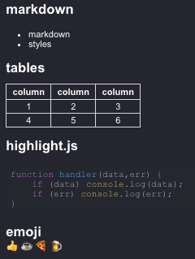
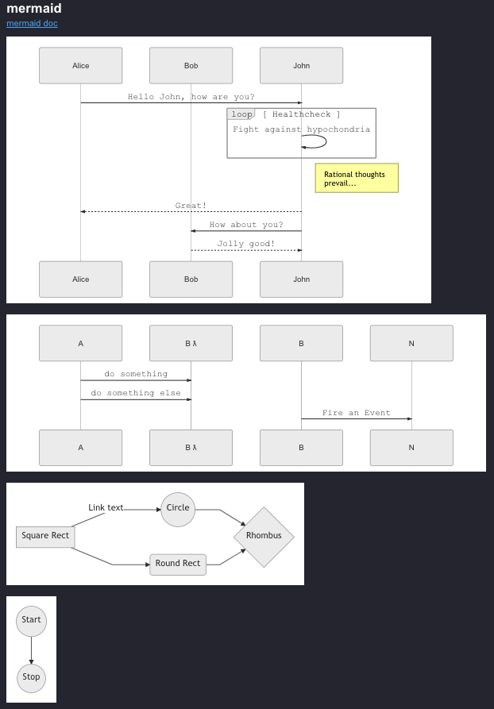

# mdp
<b>m</b>ark<b>d</b>own <b>p</b>review using marked, highlight.js, mermaid, node-emoji and live reload

[https://ericlink.github.io/mdp/](https://ericlink.github.io/mdp/)

## features

### highlight.js
syntax highlighting [https://highlightjs.org/](https://highlightjs.org/)

### mermaid diagrams
[https://mermaidjs.github.io/](https://mermaidjs.github.io/)

### node-emoji
[https://github.com/omnidan/node-emoji](https://github.com/omnidan/node-emoji)

[supported emoji](https://raw.githubusercontent.com/omnidan/node-emoji/master/lib/emoji.json)

### marked markdown parsing
github flavored markdown

[https://marked.js.org/](https://marked.js.org/)

[https://github.com/markedjs/marked](https://github.com/markedjs/marked)

[example.md](https://github.com/ericlink/mdp/blob/master/assets/example.md)

### keys

_Open as HTML_ &#8984;K

_Edit Markdown_ &#8984;E

_Zoom_ - zoom in &#8984;+, zoom out &#8984;-, actual size &#8984;0

### macOS

full screen support

dark mode window

### command line

put `mdp.app/Contents/Resources/app/package/mdp` script in your path

### logs

on Linux - `~/.config/<app name>/log.log`

on macOS - `~/Library/Logs/<app name>/log.log`

on Windows - `%USERPROFILE%\AppData\Roaming\<app name>\log.log`

## dev notes
1. `npm install`
1. `npm run dev`

### test and publish
1. `npm run dev &` - run in background to test open-file with subsequent open
1. `npm run dev-noarg` - tests launch with no arg, app starts with no window
1. `./node_modules/.bin/electron ./src/main.js ./README.md`
1. `npm run dev-publish`
1. open from finder once packaged
1. open from mdp shell script once packaged
1. `tail -f ~/Library/Logs/mdp/log.log`

upstream repo is `git clone https://github.com/ericlink/electron-forge-webapp-template.git`

### package
1. `npm install`
1. `npm run package`
1. `npm run make && npm run publish`

### package for app store
1. `cat ~/.appl_pass`
1. `npm make`
1. `npm run apple-upload`

