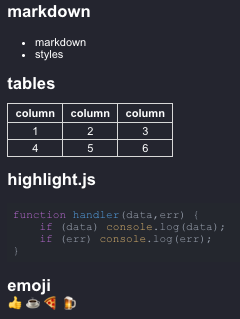
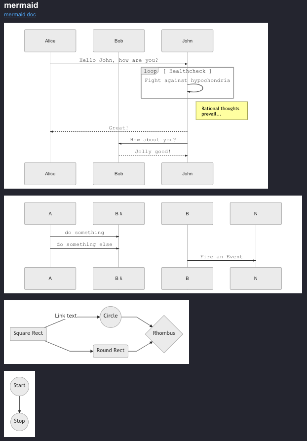

# mdp
<b>m</b>ark<b>d</b>own <b>p</b>review for local files using Electron, marked, highlight.js, mermaid, node-emoji, and automatic file watching.

[https://ericlink.github.io/mdp/](https://ericlink.github.io/mdp/)

## features

### highlight.js
syntax highlighting [https://highlightjs.org/](https://highlightjs.org/)

### mermaid diagrams
[https://mermaidjs.github.io/](https://mermaidjs.github.io/)

### node-emoji
[https://github.com/omnidan/node-emoji](https://github.com/omnidan/node-emoji)

[supported emoji](https://raw.githubusercontent.com/omnidan/node-emoji/master/lib/emoji.json)

### marked markdown parsing
github flavored markdown

[https://marked.js.org/](https://marked.js.org/)

[https://github.com/markedjs/marked](https://github.com/markedjs/marked)

[example.md](https://github.com/ericlink/mdp/blob/master/assets/example.md)

### keys

_Open as HTML_ &#8984;K

_Edit Markdown_ &#8984;E

_Zoom_ - zoom in &#8984;+, zoom out &#8984;-, actual size &#8984;0

### macOS

full screen support

dark mode window

### architecture

isolated renderer with a preload bridge

markdown links between local `.md` files stay inside the preview

external links open in your default browser

### command line

put `mdp.app/Contents/Resources/app/package/mdp` script in your path

### internal mac distribution

build unsigned Apple Silicon artifacts with:

`npm run make:mac-internal`

Electron Forge writes the unsigned `.dmg` and `.zip` to `out/make/`.

Install by opening the `.dmg` and dragging `mdp.app` into `/Applications`.

To make `mdp` the default app for Markdown files, pick any `.md` file in Finder, choose `Get Info`, set `Open with` to `mdp`, then click `Change All...`.

### logs

unexpected main-process failures are written to `/tmp/mdp-main.log`

### development

`npm install`

`npm run dev`

`npm run dev-readme`
