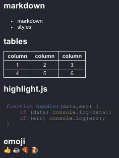
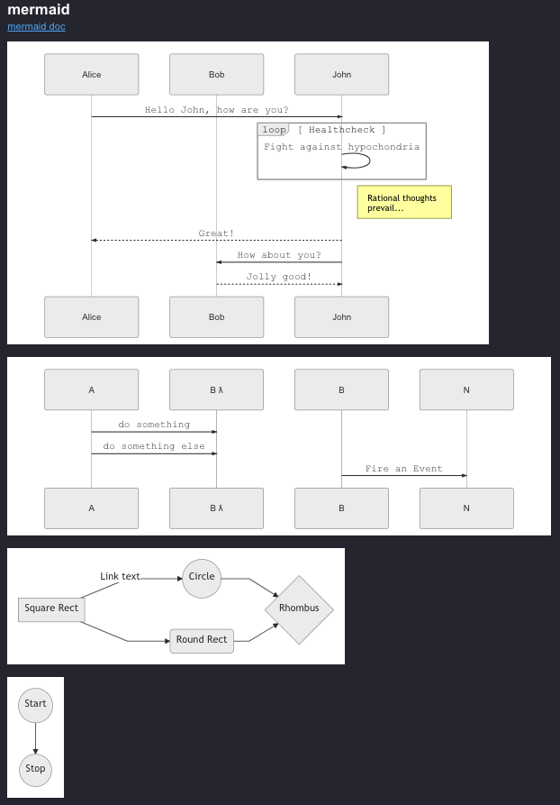

# mdp
<b>m</b>ark<b>d</b>own <b>p</b>review for local files using Electron, marked, highlight.js, mermaid, node-emoji, and automatic file watching.

[https://ericlink.github.io/mdp/](https://ericlink.github.io/mdp/)

## features

### highlight.js
syntax highlighting [https://highlightjs.org/](https://highlightjs.org/)

### mermaid diagrams
[https://mermaidjs.github.io/](https://mermaidjs.github.io/)

### node-emoji
[https://github.com/omnidan/node-emoji](https://github.com/omnidan/node-emoji)

[supported emoji](https://raw.githubusercontent.com/omnidan/node-emoji/master/lib/emoji.json)

### marked markdown parsing
github flavored markdown

[https://marked.js.org/](https://marked.js.org/)

[https://github.com/markedjs/marked](https://github.com/markedjs/marked)

[example.md](https://github.com/ericlink/mdp/blob/master/assets/example.md)

### keys

_Open as HTML_ &#8984;K

_Edit Markdown_ &#8984;E

_Zoom_ - zoom in &#8984;+, zoom out &#8984;-, actual size &#8984;0

### macOS

full screen support

dark mode window

### architecture

isolated renderer with a preload bridge

markdown links between local `.md` files stay inside the preview

external links open in your default browser

### command line

put `mdp.app/Contents/Resources/app/package/mdp` script in your path

### build and install

`npm install`

`package` writes an unpacked app under `out/`. `local-install` copies that app onto this machine. `make` writes installers under `out/make/`.

`npm run package` and `npm run make` target the operating system you are on. `npm run local-install` is the macOS install.

#### macOS

Unsigned Apple Silicon build. Needs [nvm](https://github.com/nvm-sh/nvm) with Node 22.

`npm run package:mac-internal`

writes `out/mdp-darwin-arm64/mdp.app`

`npm run local-install`

copies that app to `/Applications/mdp.app`

`npm run make:mac-internal`

writes an unsigned disk image and zip:

`out/make/mdp-<version>-arm64.dmg`

`out/make/zip/darwin/arm64/mdp-darwin-arm64-<version>.zip`

Open the `.dmg` and drag `mdp.app` into `/Applications`.

To make `mdp` the default app for Markdown files, pick any `.md` file in Finder, choose `Get Info`, set `Open with` to `mdp`, then click `Change All...`.

A signed build uses `npm run package` and `npm run make`. Signing uses the Developer ID in `forge.config.js`. Set `APPL_PASS` to notarize. `npm run make` also writes `out/make/mdp-<version>-<arch>.pkg`.

#### Linux

`npm run package:linux`

writes `out/mdp-linux-x64/mdp`

`npm run local-install:linux`

copies the app to `~/.local/share/mdp` (`$XDG_DATA_HOME/mdp` when that variable is set), links `~/.local/bin/mdp`, and installs `~/.local/share/applications/mdp.desktop`. Markdown files (`.md`, `.markdown`, `.mdown`, `.mkd`, `.mkdn`, `.mdtxt`) open with mdp. `~/.local/bin` needs to be on `PATH`.

Launch with `mdp` or `npm run start:linux`.

`npm run make:linux`

writes `out/make/zip/linux/x64/mdp-linux-x64-<version>.zip`

When `dpkg` and `fakeroot` are installed, it also writes a `.deb` under `out/make/deb/x64/`. When `rpmbuild` is installed, it also writes an `.rpm` under `out/make/rpm/x64/`.

#### Windows

These scripts target Windows x64. They run on Windows, and they cross-build from Linux or macOS.

`npm run package:win`

writes `out/mdp-win32-x64/mdp.exe`

`npm run local-install:win`

copies the app to `%LOCALAPPDATA%\Programs\mdp` and adds a Start menu shortcut.

Launch with `npm run start:win` or that `mdp.exe`.

From WSL, point `LOCALAPPDATA` at the Windows profile:

`LOCALAPPDATA=/mnt/c/Users/<WindowsUser>/AppData/Local npm run local-install:win`

Launch the installed `mdp.exe` on the Windows drive. A copy of the app under `/home` hits GPU error 18.

`npm run make:win`

writes `out/make/squirrel.windows/x64/mdp-<version> Setup.exe`

### logs

unexpected main-process failures are written to `/tmp/mdp-main.log`

### development

`npm install`

`npm run dev`

`npm run dev-readme`
