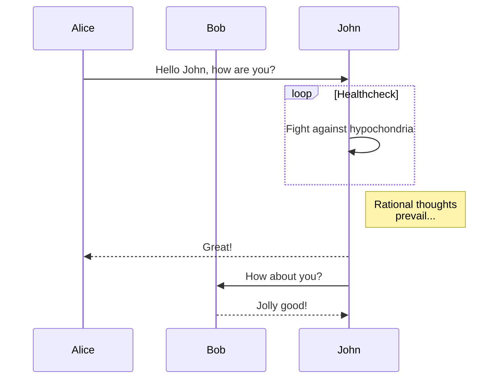
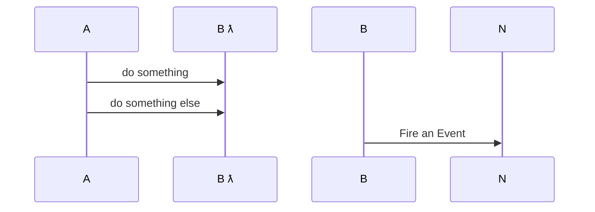
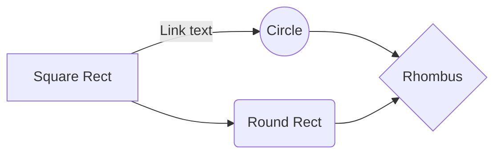
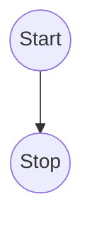
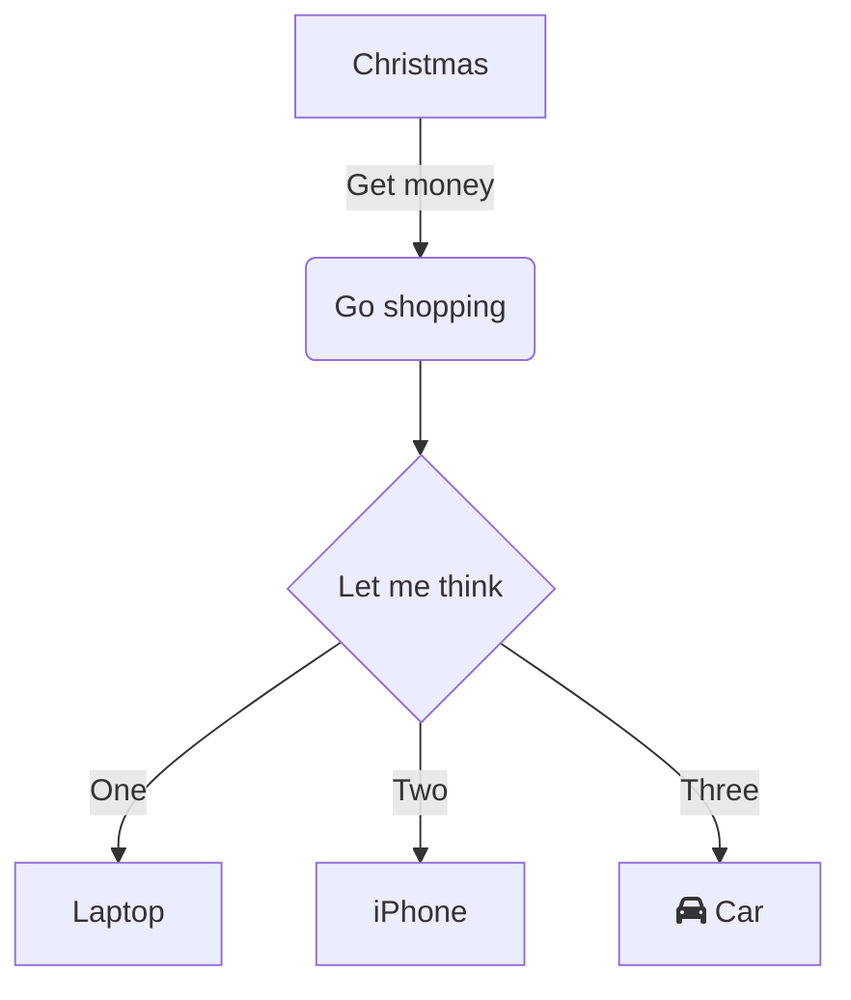
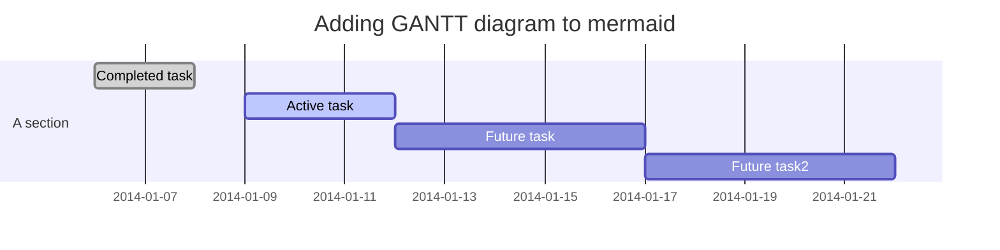
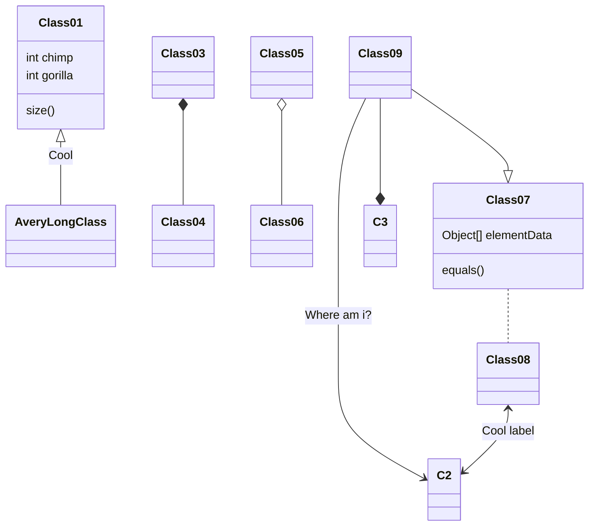

# example markdown

## markdown
- markdown
- styles

## tables
column | column | column
:--: | :--: | :--:
1|2|3
4|5|6

## highlight.js

```javascript
function handler(data,err) {
	if (data) console.log(data);
	if (err) console.log(err);
}
```
## open links in default browser

[https://github.com/ericlink/mdp](https://github.com/ericlink/mdp)

[http://github.com/ericlink/mdp](http://github.com/ericlink/mdp)

## mermaid

[mermaid doc](https://mermaidjs.github.io/flowchart.html)
















